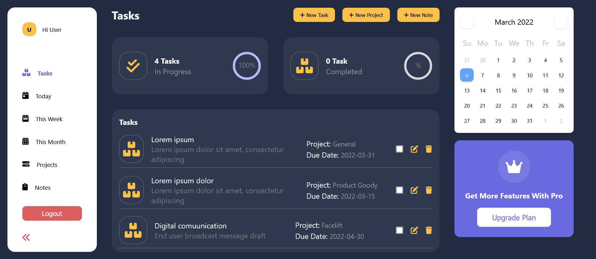

# Elegant Todo App

This project was bootstrapped with [Create React App](https://github.com/facebook/create-react-app).

## Available Scripts

In the project directory, you can run:

### `yarn start`

Runs the app in the development mode.\
Open [http://localhost:3000](http://localhost:3000) to view it in your browser.

The page will reload when you make changes.\
You may also see any lint errors in the console.

- [x] Allows add, edit and delete tasks
- [x] Create notes
- [x] Create projects
- [x] Add due date
- [x] Update tasks, notes and projects
- [x] Filter by due date
- [x] Login with google account
- [x] Login with email and password
- [x] Login as guest

[Live App here](https://a-adeleye.github.io/todo-app/).